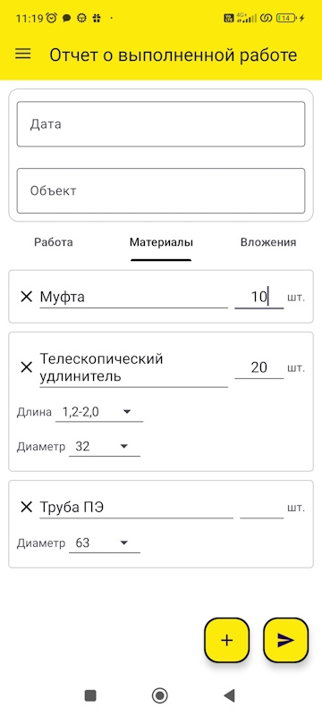

# IvLineReporting


IvLineReporting — это мобильное Android приложение, написанное на Kotlin, которое подключается к базе данных MS SQL Server. Приложение служит для ведения отчетной документации и предназначено для использования бригадирами компании ООО "ИВЛАЙН".

## Содержание

- [Описание](#описание)
- [Функции](#функции)
- [Технологии](#технологии)
- [Настройка для разработки](#настройка-для-разработки)
- [Использование](#использование)
- [Схема базы данных](#схема-базы-данных)
- [Пример SpreadsheetML файла](#пример-spreadsheetml-файла)
- [Скриншоты](#скриншоты)
- [Контакты](#контакты)
- [Лицензия](#лицензия)

## Описание

IvLineReporting — это мобильное приложение для ведения отчетной документации, разработанное для компании ООО "ИВЛАЙН". Приложение позволяет бригадирам в конце рабочего дня заполнять и отправлять отчеты в базу данных MS SQL Server. Отчеты преобразуются в файлы SpreadsheetML и сохраняются в базе данных.

## Функции

- **Три вида отчетов:**
  - **Отчет о выполненной работе:** Ввод вида выполненной работы, типа затраченных материалов и их количества, прикрепление фотографий.
  - **Отчет об отработанных часах:** Выбор сотрудников и указание количества отработанных часов для каждого.
  - **Отчет об использованной технике:** Указание задействованной техники и количества рейсов или часов работы.
- **Экран авторизации:** Данные о пользователях хранятся в базе данных в зашифрованном виде.
- **Экран помощи:** Инструкции по использованию приложения.
- **Главный экран:** Выбор вида отчета для заполнения.
- **Экраны для каждого вида отчета:** Отдельные экраны для заполнения каждого вида отчета.
- **Поддержка темной и светлой темы.**
- **Отправка уведомлений о необходимости отправить отчет за предыдущий день работы.**

## Технологии

- **Язык программирования:** Kotlin
- **Платформа:** Android
- **База данных:** MS SQL Server
- **Формат отчетов:** SpreadsheetML (XML)

## Настройка для разработки

1. Склонируйте репозиторий:
   ```sh
   git clone https://github.com/S0s0Combain/IvLineReporting.git
   cd IvLineReporting
   ```
2. Установите зависимости:
  - Убедитесь, что у вас установлен Android Studio.
  - Откройте проект в Android Studio и установите необходимые зависимости через Gradle.
3. Настройте подключение к базе данных:
  - Убедитесь, что у вас есть доступ к базе данных MS SQL Server.
  - Настройте параметры подключения к базе данных в приложении.

## Использование

1. Авторизация:
  - Введите свои учетные данные для входа в приложение.
2. Выбор отчета:
  - На главном экране выберите вид отчета, который хотите заполнить.
3. Заполнение отчета:
  - Заполните необходимые поля и отправьте отчет.
4. Просмотр отчетов:
  - Отчеты можно просматривать в базе данных в формате SpreadsheetML.

## Схема базы данных


## Пример SpreadsheetML файла

### Код XML:
```xml
<?xml version="1.0" encoding="UTF-8" standalone="yes"?>
<Workbook xmlns="urn:schemas-microsoft-com:office:spreadsheet"
          xmlns:o="urn:schemas-microsoft-com:office:office"
          xmlns:x="urn:schemas-microsoft-com:office:excel"
          xmlns:ss="urn:schemas-microsoft-com:office:spreadsheet"
          xmlns:html="http://www.w3.org/TR/REC-html40">
  <Worksheet ss:Name="Техника">
    <Table>
      <Column ss:Width="80"/>
      <Column ss:Width="56"/>
      <Column ss:Width="232"/>
      <Column ss:Width="40"/>
      <Column ss:Width="50"/>
      <Row>
        <Cell><Data ss:Type="String">Дата</Data></Cell>
        <Cell><Data ss:Type="String">Объект</Data></Cell>
        <Cell><Data ss:Type="String">Техника</Data></Cell>
        <Cell><Data ss:Type="String">Тип работы</Data></Cell>
        <Cell><Data ss:Type="String">Количество</Data></Cell>
      </Row>
      <Row>
        <Cell ss:MergeDown="3"><Data ss:Type="String">25.08.2024</Data></Cell>
        <Cell ss:MergeDown="3"><Data ss:Type="String">Саблино</Data></Cell>
        <Cell ss:Index="3"><Data ss:Type="String">Эвакуатор IVECO</Data></Cell>
        <Cell><Data ss:Type="String">Рейсы</Data></Cell>
        <Cell><Data ss:Type="Number">2</Data></Cell>
      </Row>
      <Row>
        <Cell ss:Index="3"><Data ss:Type="String">Экскаватор-погрузчик HIDROMEK</Data></Cell>
        <Cell><Data ss:Type="String">Часы</Data></Cell>
        <Cell><Data ss:Type="Number">10</Data></Cell>
      </Row>
      <Row>
        <Cell ss:Index="3"><Data ss:Type="String">Водовоз (найм)</Data></Cell>
        <Cell><Data ss:Type="String">Часы</Data></Cell>
        <Cell><Data ss:Type="Number">4</Data></Cell>
      </Row>
      <Row>
        <Cell ss:Index="3"><Data ss:Type="String">Миниэкскаватор CASE</Data></Cell>
        <Cell><Data ss:Type="String">Часы</Data></Cell>
        <Cell><Data ss:Type="Number">10</Data></Cell>
      </Row>
    </Table>
  </Worksheet>
</Workbook>
```

### Файл, открытый в Excel


## Скриншоты





## Контакты

Если у вас есть вопросы или предложения, пожалуйста, свяжитесь со мной:

- **Email:** dev.assist@yandex.ru
- **GitHub:** [S0s0Combain](https://github.com/S0s0Combain)

## License

Этот проект лицензирован под [Apache License 2.0](LICENSE).
